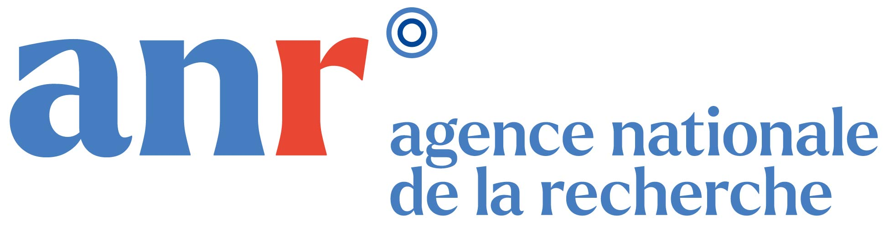
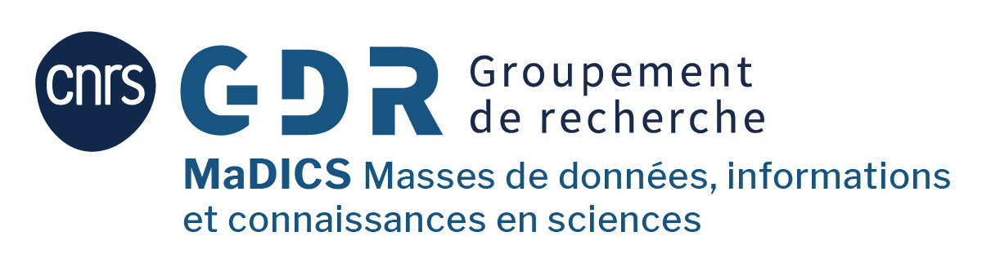

# CLEF 2024 SimpleText Track

---

[Accueil](../) | [Appel à communications](../en/CFP.md) | [Dates importantes](../en/dates.md) | [Tâches](../en/tasks.md) | [Outils](../en/tools.md) | [Programme](../en/program.md) | [Publications](../en/publications.md) | [Organisateurs](../en/organizers.md) | [Contact](../en/contact.md) | [CLEF-2023](https://simpletext-project.com/2023/clef/)

---

  

## SimpleText : Simplification automatique des textes scientifiques

Le grand public a tendance à éviter les sources fiables telles que la littérature scientifique en raison de leur langage complexe et du manque de connaissances de base. Au lieu de cela, ils s'appuient sur des sources superficielles et dérivées sur le web et dans les médias sociaux - souvent publiées pour des raisons commerciales ou politiques, plutôt que pour leur valeur informative. La simplification des textes peut-elle contribuer à supprimer certains de ces obstacles à l'accès ? La piste SimpleText fait partie de l'initiative CLEF qui promeut l'évaluation systématique des systèmes d'accès à l'information, principalement par l'expérimentation sur des tâches partagées. SimpleText aborde les défis des approches de simplification des textes dans le contexte de la promotion de l'accès à l'information scientifique, en fournissant des données et des repères appropriés. La piste utilise un corpus de résumés de littérature scientifique et de demandes de vulgarisation scientifique. Notre cas d'utilisation global consiste à créer un résumé simplifié de plusieurs documents scientifiques sur la base d'une requête scientifique populaire qui fournit à l'utilisateur une vue d'ensemble accessible de ce sujet spécifique.  
La piste comporte les quatre tâches concrètes suivantes.
 
## [Tâches](./tasks)
- [Tâche 1 :](./tasks) Qu'est-ce qui entre (ou sort) ? Sélection des passages à inclure dans un résumé simplifié.
- [Tâche 2 :](./tasks) Qu'est-ce qui n'est pas clair ? Identification et explication de concepts difficiles (définitions, décryptage d'abréviations, contexte, applications,...).
- [Tâche 3 :](./tasks) Réécrivez ceci ! A partir d'une requête, simplifier des passages de résumés scientifiques.
- [Tâche 4 :](./tasks) SOTA ? À partir d'un article sur l'IA faisant état des performances d'un modèle sur des ensembles de données de référence, extraire toutes les informations connexes (tâche, ensemble de données, métrique, score).

## Comment participer
Pour participer, il faut s'inscrire sur le site de la [CLEF](https://clef2024.clef-initiative.eu/index.php). L'inscription est ouverte le 13 novembre 2023.

Tous les membres de l'équipe doivent s'inscrire à la liste de diffusion SimpleText : h[ttps://groups.google.com/g/simpletext](https://groups.google.com/g/simpletext). 

Les données seront mises à la disposition de tous les participants inscrits.

## Remerciements  

SimpleText est soutenu par le réseau de recherche français sur le Big Data - Data Science [MADICS](https://www.madics.fr/). Cette recherche a été financée, en tout ou en partie, par l'Agence nationale de la recherche (ANR) dans le cadre du projet [ANR-22-CE23-0019-01](https://anr.fr/Project-ANR-22-CE23-0019).

## Références  

- L. Ermakova, E. SanJuan, S. Huet, H. Azarbonyad, O. Augereau, J. Kamps. "Aperçu du laboratoire CLEF 2023 SimpleText : Simplification automatique des textes scientifiques". Proceeding of CLEF'23, LNCS, Springer
- L. Ermakova, E. SanJuan, S. Huet, O. Augereau, H. Azarbonyad et J. Kamps. "CLEF 2023 SimpleText Track : Que se passe-t-il si des utilisateurs généraux effectuent des recherches dans des textes scientifiques ? Actes d'ECIR 2023
- [É. Sanjuan, S. Huet, J. Kamps, L. Ermakova. "Aperçu de la tâche SimpleText CLEF 2023 1 : Sélection de passages pour un résumé simplifié".](https://www.dei.unipd.it/~faggioli/temp/CLEF2023-proceedings/paper-238.pdf)
- [L. Ermakova, H. Azarbonyad, S. Bertin, O. Augereau. "Aperçu de la tâche CLEF 2023 SimpleText 2 : Identification et explication de concepts difficiles".](https://www.dei.unipd.it/~faggioli/temp/CLEF2023-proceedings/paper-239.pdf)
- [L. Ermakova, S. Bertin, H. McCombie, J. Kamps. "Aperçu de la tâche CLEF 2023 SimpleText 3 : Simplification des textes scientifiques".](https://www.dei.unipd.it/~faggioli/temp/CLEF2023-proceedings/paper-240.pdf)

---

    

